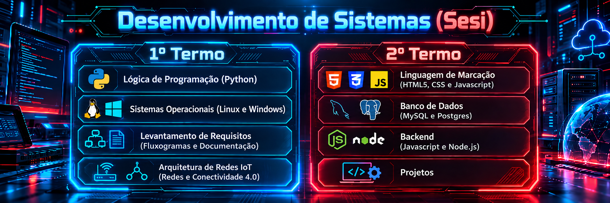

<p align="center">
  
</p>

# 💻 Desenvolvimento de Sistemas — SESI

Repositório acadêmico para acompanhamento da jornada de aprendizagem em **Desenvolvimento de Sistemas**, reunindo códigos, atividades, documentação técnica, experimentos e projetos desenvolvidos durante o curso.

O GitHub faz parte da própria aprendizagem: além de registrar os materiais, ele permite praticar **versionamento, colaboração, documentação e organização profissional de projetos**.

---

## 🗺️ Trilha de aprendizagem

| Termo | Unidade Curricular | Principais conteúdos |
|---|---|---|
| **1º Termo** | 🐍 Lógica de Programação | Python, algoritmos, estruturas de decisão, repetições, funções e resolução de problemas |
| **1º Termo** | 🖥️ Sistemas Operacionais | Linux, Windows, terminal, sistemas de arquivos, processos e administração básica |
| **1º Termo** | 📋 Levantamento de Requisitos | Fluxogramas, documentação, requisitos, modelagem e organização da solução |
| **1º Termo** | 🌐 Arquitetura de Redes e IoT | Redes, conectividade, protocolos, dispositivos IoT e Indústria 4.0 |
| **2º Termo** | 🧱 Linguagem de Marcação | HTML5, CSS3, JavaScript, responsividade e interfaces Web |
| **2º Termo** | 🗄️ Banco de Dados | Modelagem de dados, SQL, MySQL e PostgreSQL |
| **2º Termo** | ⚙️ Backend | JavaScript, Node.js, APIs e integração de sistemas |
| **2º Termo** | 🚀 Projetos | Desenvolvimento integrado de soluções e protótipos |

---

## 🛠️ Tecnologias trabalhadas

<p align="center">
  
  
  
  
  
  
  
  
  
  
  
</p>

---

## 📂 Navegação rápida

O repositório já está organizado por termos:

### 🔵 1º Termo
➡️ [`1TERMO`](./1TERMO/)

Conteúdos relacionados a **Lógica de Programação, Sistemas Operacionais, Levantamento de Requisitos e Arquitetura de Redes/IoT**.

### 🔴 2º Termo
➡️ [`2TERMO`](./2TERMO/)

Conteúdos de **Linguagem de Marcação, Banco de Dados, Backend e Projetos**.

---

## 🧩 Como os conteúdos são desenvolvidos

A aprendizagem é construída por meio de:

- explicações e demonstrações técnicas;
- exercícios progressivos;
- pesquisas orientadas;
- situações-problema;
- documentação e modelagem;
- práticas de laboratório;
- projetos integradores;
- uso contínuo de Git e GitHub.

A ideia é avançar da **compreensão do problema** para a **construção e validação da solução**, integrando programação, infraestrutura, dados e desenvolvimento Web.

---

## 🌐 Integração entre as unidades curriculares

```text
Requisitos
    ↓
Lógica e Algoritmos
    ↓
Interface Web
    ↓
Backend
    ↓
Banco de Dados
    ↓
Redes / IoT
    ↓
Projeto Integrador
```

Essa integração permite compreender o desenvolvimento de sistemas como um processo completo, e não como disciplinas isoladas.

---

## ✅ Fluxo recomendado com Git

Antes de começar:

```bash
git pull
```

Depois de desenvolver:

```bash
git add .
git commit -m "feat: descrição da atividade"
git push
```

Sempre que possível, documente seus projetos com `README.md`, descrevendo **objetivo, tecnologias, funcionamento e instruções de execução**.

---

## 🎯 Objetivo do repositório

Construir, ao longo do curso, um registro técnico da evolução dos estudantes e um conjunto de projetos que possa servir também como **portfólio de aprendizagem**.

---

## 👨‍🏫 Professor

**Bruno Augusto de Moraes**  
Desenvolvimento de Sistemas • Programação • Banco de Dados • Redes • IoT

---

<p align="center">
  <strong>Do algoritmo ao projeto: aprender, desenvolver, testar e evoluir.</strong>
</p>
